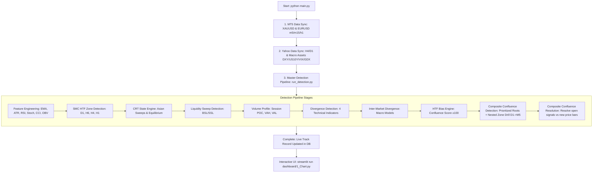

# Multi-Asset Quant Trading System (XAUUSD & EURUSD) — Master Project Context & Claude Handover Guide

> **Document Version:** 2.0 (Post-Nested Zone Drilling & Composite Confluence Engine Adoption)  
> **Target Audience:** Claude AI Assistant / Quant Developers / Systematic Trading Engineers  
> **Workspace Root:** `Quant_Trade_Active/` (`mt5-tracker/`)  
> **Key References:** [`docs/DECISIONS.md`](file:///c:/Users/ACER/Desktop/Quant_Trade_Active/mt5-tracker/docs/DECISIONS.md), [`README.md`](file:///c:/Users/ACER/Desktop/Quant_Trade_Active/mt5-tracker/README.md), [`main.py`](file:///c:/Users/ACER/Desktop/Quant_Trade_Active/mt5-tracker/main.py)

---

## 1. Executive Overview & Core Philosophy

This repository is a **production-grade quantitative trading system and analytics engine** for **Gold (XAUUSD)** and **Euro (EURUSD)**. The core philosophy is **empirical rigor and walk-forward statistical validation** (adhering to David Bailey & Marcos López de Prado's *Deflated Sharpe Ratio* and minimum sample size standards). Nothing is traded or kept in the active scoring model based on visual chart appeal or theoretical assumptions without empirical backtest proof against real historical market data.

### Key Architectural Evolution:
1. **Medallion Data Architecture:** 3-tier layering (`raw_*` immutable OHLCV/macro -> `curated_*` computed zones, features, bias, signals -> `mart_*` trade performance & reporting).
2. **Current Production Trading Engine:** **Composite Confluence Engine** with **Nested Zone Drilling** (`analysis/strategies/nested_zone_engine.py` + `composite_confluence_engine.py`).
3. **Execution Paradigm:** Anchors on higher timeframe structural levels (D1/H6/H4/H1), then drills down hierarchically into fine-grained intraday sub-zones (M15/M5) to achieve ultra-tight risk (Stop Loss) and high Reward-to-Risk (R:R median ~2.5R - 2.8R+ with validated win rates > 70-90% in 180-day walk-forward tests).
4. **Airflow Removed:** Apache Airflow was fully removed as legacy overhead; pipeline is orchestrated cleanly via `main.py` and modular standalone scripts.

---

## 2. Project File & Directory Structure

```
Quant_Trade_Active/
├── CLAUDE.md                           # Master handover & project context guide
└── mt5-tracker/                        # Primary project codebase
    ├── main.py                         # Single pipeline entry point (MT5 Sync -> Yahoo Sync -> Detection)
    ├── docker-compose.yml              # MySQL 8.0 (Port 3308) + phpMyAdmin (Port 8084)
    ├── requirements.txt                # Python core dependencies
    ├── requirements-mt5.txt            # MT5 integration dependencies
    ├── .env / .env.example             # Database credentials & MT5 account config
    │
    ├── fetcher/                        # Data Ingestion & Normalization Layer
    │   ├── yahoo_finance_client.py     # Yahoo Finance API client (OHLCV, FX, Macro)
    │   ├── market_fetcher.py           # Multi-asset fetcher (DXY, US10Y, VIX, GDX)
    │   ├── fred_fetcher.py             # Macro data: Fed Funds, TIPS, Breakeven Inflation
    │   ├── ecb_fetcher.py              # European Central Bank yield data
    │   ├── gpr_fetcher.py              # Geopolitical Risk Index fetcher
    │   ├── cot_fetcher.py              # CFTC Commitments of Traders institutional positioning
    │   ├── spdr_fetcher.py             # SPDR Gold Trust physical holdings
    │   ├── symbols.py                  # Symbol registry & metadata definitions
    │   └── timezone_utils.py           # UTC conversion & timezone sanity utilities
    │
    ├── storage/                        # Database Schemas & Migrations
    │   ├── schema_raw.sql              # Raw OHLCV tables for Gold, EURUSD, DXY, VIX, etc.
    │   ├── schema_curated.sql          # Curated layer: SMC, CRT, Divs, Bias, Signals, Nested Chains
    │   ├── schema_mart.sql             # Mart layer for summary reporting & analytics
    │   └── migrations/                 # Incremental schema evolution scripts
    │
    ├── analysis/                       # Quantitative Signal Engines & Analytics
    │   ├── smc_crt/                    # Smart Money Concepts & Candle Range Theory
    │   │   ├── smc_engine.py           # Base SMC calculation primitives
    │   │   ├── smc_state.py            # SMC Zone State Tracker (Active/Mitigated/Invalidated)
    │   │   ├── structure.py            # Swing Highs/Lows, BOS, and CHoCH detection
    │   │   ├── imbalance.py            # Fair Value Gap (FVG) detection
    │   │   ├── order_block.py          # Order Block identification
    │   │   ├── liquidity.py            # Liquidity sweep (BSL/SSL) detection
    │   │   └── crt_state.py            # CRT Asian session sweep (H1) & Range Equilibrium (H4/H6/D1)
    │   ├── features/                   # Indicator Feature Engineering
    │   │   ├── technical_features.py   # EMA (20/50/200), ATR(14), RSI(14), Stoch, CCI, OBV
    │   │   └── resampler.py            # Resampling utilities (H1 -> H4, H6, D1)
    │   ├── divergence/                 # Divergence Matrix (11 Active Models)
    │   │   ├── technical_divergence_state.py   # RSI, OBV, Stochastic, CCI (Regular & Hidden)
    │   │   └── intermarket_divergence_state.py # Macro: XAU/DXY, EUR/DXY, XAU/US10Y, GDX, COT, SPDR
    │   ├── volume_profile/             # Volume Profile Engine
    │   │   └── volume_profile_state.py # Session POC, VAH (70%), VAL (70%), HVN, LVN
    │   ├── strategies/                 # Strategy & Synthesis Engines
    │   │   ├── htf_bias_engine.py      # HTF Confluence Score (±100) & directional bias
    │   │   ├── nested_zone_engine.py   # [CORE PRODUCTION] Hierarchical zone drilling (D1->M5)
    │   │   ├── composite_confluence_engine.py # [CORE PRODUCTION] 5-factor scoring & trade setups
    │   │   ├── structural_tp_engine.py # Structural Target Ladder (TP1..TP5) calculation
    │   │   ├── confluence_zone_engine.py      # Multi-zone overlap detection
    │   │   └── ltf_trigger_engine.py   # LTF micro-structure triggers
    │   └── backtester/                 # Rigorous Backtesting Engines
    │       ├── structural_backtest_engine.py  # Walk-forward simulation with ambiguous-bar drilldown
    │       ├── vectorized_backtest.py         # Fast parameter sweep backtester
    │       └── metrics.py                     # Expectancy (R), Win Rate, Sharpe, Max Drawdown
    │
    ├── scripts/                        # Automated Operational & Research Scripts
    │   ├── sync/                       # Data Synchronization
    │   │   ├── scheduler/              # MT5 Background Sync Service (`mt5_sync_service.py`)
    │   │   ├── sync_yahoo.py           # Syncs Gold/EURUSD H4/D1 + DXY, US10Y, VIX, GDX
    │   │   └── sync_*.py               # Sync scripts for FRED, ECB, GPR, COT, SPDR
    │   ├── detection/                  # Curated Detection Pipeline
    │   │   ├── run_detection.py        # Master detection runner (executes all stages in order)
    │   │   ├── run_feature_engineering.py
    │   │   ├── run_smc_zone_detection.py
    │   │   ├── run_crt_detection.py
    │   │   ├── run_liquidity_sweep_detection.py
    │   │   ├── run_volume_profile.py
    │   │   ├── run_divergence_detection.py
    │   │   ├── run_intermarket_divergence_detection.py
    │   │   ├── run_htf_bias_detection.py
    │   │   ├── run_composite_confluence_detection.py  # Generates & upserts nested chain signals
    │   │   └── run_composite_confluence_resolution.py # Resolves open signals vs new price bars
    │   ├── backtest/                   # Backtest Runners & Statistical Validation
    │   │   ├── run_structural_backtest.py
    │   │   ├── grid_search_structural_tp.py
    │   │   ├── compare_structural_tp_variants.py
    │   │   ├── bootstrap_ci_and_mcc.py
    │   │   └── random_entry_baseline.py
    │   └── diagnostic/                 # Diagnostic & Cleanup Utilities
    │       └── ...                     # Timezone verification, data diffing, integrity scripts
    │
    ├── dashboard/                      # Streamlit Interactive Web Application
    │   ├── 1_Chart.py                  # Primary interactive multi-TF candlestick & nested overlay
    │   └── pages/
    │       ├── 3_LTF_Triggers.py       # Active & Historical Composite Confluence Signals view
    │       ├── 4_Divergence.py         # Technical & Macro Divergence monitoring
    │       ├── 5_Backtest_Results.py   # Historical backtest metrics & equity curve breakdown
    │       └── 6_Run_Pipeline.py       # GUI trigger to run pipeline on demand
    │
    └── docs/                           # Documentation & Knowledge Base
        ├── DECISIONS.md                # [CRITICAL] 300KB+ Complete record of every design decision,
        │                               # validated experiment, rejected model, and bug fix.
        └── README-MT5.md               # MetaTrader 5 setup and broker connection guide
```

---

## 3. Data Architecture & Database Schema Breakdown

The system implements a **Medallion Data Architecture** running on **MySQL 8.0 (Port 3308)**:

```
+-----------------------------------------------------------------------------------+
| 1. RAW LAYER (Immutable Ingested Data)                                            |
|    - raw_gold / raw_eurusd : m5, m15, h1 (from MT5), h4, h6, d1 (resampled/Yahoo) |
|    - raw_dxy / raw_vix / raw_silver : h1, d1 (from MT5)                           |
|    - raw_us10y / raw_gdx : d1 (from Yahoo Finance)                                |
|    - raw_fred / raw_ecb / raw_gpr / raw_cot / raw_spdr : Macro / Institutional    |
+-----------------------------------------+-----------------------------------------+
                                          |
                                          v
+-----------------------------------------------------------------------------------+
| 2. CURATED LAYER (Computed Features, Zones & Signals)                             |
|    - curated_gold / curated_eurusd :                                              |
|      * features                     : Technical indicators (EMA, ATR, RSI, etc.)  |
|      * smc_signals                  : HTF zones (D1/H6/H4/H1: OB, FVG, Swings)   |
|      * crt_signals                  : Asian Sweeps (H1) & Range Equilibrium (H4+) |
|      * liquidity_sweeps             : BSL / SSL Wick sweeps                       |
|      * volume_profile               : Session POC, VAH, VAL, HVN, LVN             |
|      * divergence_signals           : 11 Technical & Inter-market divergence sets |
|      * htf_bias                     : Bar-by-bar bias score (-100 to +100)        |
|      * ltf_smc_zones                : Fine-grained M15/M5 zones (nested drilling) |
|      * nested_zone_chains           : D1->H6->H4->H1->M15->M5 hierarchical chains |
|      * composite_confluence_signals : Production trade setups & live resolution   |
+-----------------------------------------+-----------------------------------------+
                                          |
                                          v
+-----------------------------------------------------------------------------------+
| 3. MART LAYER (Consolidated Performance & Analytics)                              |
|    - mart_gold / mart_eurusd : Summary trade logs, strategy KPIs, equity curves   |
+-----------------------------------------------------------------------------------+
```

### Key Curated Database Tables & Fields:
- **`composite_confluence_signals`**: The primary signal record.
  - `symbol`, `ltf_timeframe`, `direction` (`bullish`/`bearish`), `confirmed_at_bar`.
  - **Factors (5-Factor Score, Threshold >= 3/5)**: `f_sweep`, `f_choch`, `f_zone_stack`, `f_bias`, `f_div` (plus `f_crt` recorded for telemetry but excluded from score).
  - **Execution Params**: `entry_price`, `stop_price`, `risk_distance`, `tp1_price` .. `tp5_price`, `tp1_rr` (Minimum R:R >= 2.0).
  - **Outcome Tracking**: `exit_reason` (`open`, `win`, `loss`), `exit_bar_datetime`, `resolution_method`, `r_outcome`.
  - **Audit & Human-in-the-Loop**: `entry_mechanism` (`nested_chain` or legacy `h1_touch`), `zone_chain` (JSON trace of the drilled levels), `user_action`, `user_note`.

---

## 4. End-to-End Pipeline & Operational Workflow

### Execution Flow:


### Standard Developer Commands:

```bash
# 1. Start MySQL & phpMyAdmin Docker containers
docker-compose up -d

# 2. Run the complete pipeline (Sync -> Features -> Detection -> Signals -> Resolution)
python main.py

# 2b. Dry-run detection without modifying database (Report only)
python main.py --no-write

# 3. Launch Interactive Streamlit Dashboard
streamlit run dashboard/1_Chart.py

# 4. Run Backtest Simulation
python scripts/backtest/run_structural_backtest.py --symbol XAUUSD --all-timeframes
```

---

## 5. Quantitative Strategy Details & Math Rules

### 1. Smart Money Concepts (SMC Engine)
- **Swing Points:** Determined via fractal pivot highs/lows.
- **Break of Structure (BOS):** Continuation break of recent swing extreme.
- **Change of Character (CHoCH):** Structural reversal break indicating shift in trend.
- **Order Blocks (OB):** The last contrary candle preceding high-displacement impulsive expansion.
- **Fair Value Gaps (FVG):** Imbalance 3-candle pattern (`Bullish FVG: High[i-2] < Low[i]`).
- **Recency Filter:** Only active zones formed within the last **720 H1 bars** are maintained to prevent stale zone accumulation.

### 2. Candle Range Theory (CRT Engine)
- **Asian Session (00:00–06:00 UTC):** High/Low range calculated strictly on H1 bars.
- **Session Sweeps:** Intraday breach of Asian High/Low during London/NY open followed by a close back inside the range.
- **Range Equilibrium:** 50% midpoint (`(High + Low) / 2`) on H4, H6, and D1 bars to evaluate Premium vs. Discount zones.

### 3. Divergence Matrix (11 Active Models)
- **Technical (4 Indicators across Timeframes):** RSI, OBV, Stochastic, CCI.
  - *Regular Divergence:* Price makes Higher High / Lower Low while indicator fails -> Trend Reversal risk (used to dampen HTF Bias score).
  - *Hidden Divergence:* Price makes Higher Low / Lower High while indicator makes extreme -> Trend Continuation confirmation.
  - *Pivot-Side Rule:* `classify_divergence(pivot_type='low' | 'high')` must be explicitly parameterized to avoid mathematical classification ambiguity.
- **Inter-Market Macro Divergences:**
  - XAUUSD vs. DXY (Decoupling strength)
  - EURUSD vs. DXY (Dollar decoupling)
  - XAUUSD vs. US 10-Year Real Yield (Negative correlation divergence)
  - XAUUSD vs. GDX (Gold miners leading physical gold)
  - CFTC COT Commercial vs. Non-Commercial net positioning
  - SPDR Gold Shares ETF physical vault holdings trend vs. price

### 4. HTF Bias Engine
- Integrates SMC structure, indicators, sweeps, and divergence into a single score per bar (-100 to +100):
  - **SMC Net Zones:** Primary structural weight (Cap ±30).
  - **Indicators (EMA Trend / RSI):** Secondary weight (Cap ±20).
  - **CRT & Liquidity Sweeps:** Session confirmation (Cap ±15 each).
  - **Volume Profile (POC alignment):** (Cap ±10).
  - **Divergence Multiplier:** Hidden adds directional points; Regular applies multiplicative damping ($0.7225$ floor) to prevent total structural score cancellation.

### 5. Composite Confluence Engine & Nested Zone Drilling (Production Core)
- **Root Zone Prioritization:** Filters HTF root zones (D1/H6/H4/H1) requiring **$\ge 2$ of 5 composite factors** within tight lookback windows before spending compute on drilling.
- **Hierarchical Drilling:** Drills from the prioritized HTF root down the strict hierarchy **D1 $\rightarrow$ H6 $\rightarrow$ H4 $\rightarrow$ H1 $\rightarrow$ M15 $\rightarrow$ M5**, selecting the tightest valid sub-zone at each level.
- **5-Factor Confluence Scoring (Threshold $\ge 3 / 5$):**
  1. `f_sweep`: Liquidity sweep within touch window.
  2. `f_choch`: Reversal CHoCH structural break within window (**CHoCH only; BOS is excluded**).
  3. `f_zone_stack`: Timeframe-weighted multi-TF zone presence (`D1=4, H6=3, H4=2, H1=1`, threshold sum $\ge 2$).
  4. `f_bias`: Aligned HTF Bias score direction.
  5. `f_div`: Aligned technical or inter-market divergence.
  *(Note: `f_crt` is computed for telemetry but explicitly excluded from score sum).*
- **Risk Management & Target Ladder:**
  - **Stop Loss:** `nearest_structure` (unbiased swing point or zone boundary).
  - **Take Profit Ladder (TP1..TP5):** Structural targets ranked by volume nodes/swings.
  - **Minimum Threshold:** $TP1\_RR \ge 2.0$ (median $2.5R - 2.8R+$).

---

## 6. Critical Engineering Decisions & Historical Pitfalls (DO NOT REPEAT)

When working on this codebase, **Claude must adhere to all historical decisions recorded in [`docs/DECISIONS.md`](file:///c:/Users/ACER/Desktop/Quant_Trade_Active/mt5-tracker/docs/DECISIONS.md)**:

| Topic | Validated Decision & Rule | Why / Historical Evidence |
| :--- | :--- | :--- |
| **CRT in Composite Score** | **DO NOT add CRT to composite score** | Tested as gate & score factor: reduced win rate & degraded expectancy to $-0.126R$ (EUR) and $+0.008R$ (Gold). SMC+Divergence without CRT yields $+0.433R / +0.327R$. |
| **BOS in `f_choch`** | **DO NOT include BOS in `f_choch`** | BOS is $\sim 10\times$ more frequent than CHoCH; including it diluted factor specificity and dropped Gold win rate by 9 percentage points. Keep CHoCH-only. |
| **Stop Loss Calculation** | **Must use `nearest_structure`** | MAE-based stop calculations introduced survivorship bias. `nearest_structure` is strictly unbiased. |
| **Timezone Handling** | **All timestamps MUST be UTC** | Past bug: local midnight timestamps (`00:00`) created 44,500 duplicate/shifted rows. Always enforce UTC conversion. |
| **Precision per Asset** | **EURUSD = 5 decimals, Gold = 2 decimals** | Hardcoding 2 decimals caused 100% flat-price bars on EURUSD. `reject_flat_ohlc` flag is enabled for EURUSD but disabled for Gold (where flat bars occur naturally). |
| **DB Upsert Collisions** | **Prevent stale outcome columns on re-upsert** | When updating signal parameters via `ON DUPLICATE KEY UPDATE`, reset `exit_reason='open'` and re-resolve to prevent stale outcomes against altered stops/targets. |
| **Airflow Infrastructure** | **DO NOT create Airflow DAGs** | Airflow was completely removed. Orchestration is handled via `main.py` and modular Python services. |
| **Dashboard Architecture** | **Candlestick overlays live in `1_Chart.py` only** | User explicitly rejected separate chart pages/panels for Nested Zones. All overlays integrate directly into the master chart on `dashboard/1_Chart.py`. |

---

## 7. Current Project Status & Future Roadmap

### ✅ Completed & Fully Validated:
- Full ingestion pipeline (MT5 m5/m15/h1 + Yahoo H4/D1 + Macro feeds).
- Medallion MySQL storage with automated timezone verification.
- Complete SMC, CRT, Volume Profile, and Divergence (11 models) engines.
- HTF Bias Engine with dynamic liquidity sweep weighting.
- **Nested Zone Drilling & Composite Confluence Engine** running in production (`run_detection.py` and `main.py`).
- Automated signal resolution engine (`run_composite_confluence_resolution.py`).
- Interactive Streamlit dashboard with multi-timeframe overlays.

### ⏳ Pending Roadmap & Future Enhancements:
1. **Dynamic Economic Calendar / High-Impact News Filter:** Forward-looking filter for FOMC, NFP, CPI releases.
2. **Trade Management Automation:** Partial TP taking (e.g. 50% at TP1, move SL to breakeven, trailing runner to TP2+).
3. **Execution Integration / Bridge:** MetaTrader 5 live order execution bridge based on resolved `composite_confluence_signals`.
4. **Incremental Nested Drilling Optimization:** Caching intermediate zone hierarchies to accelerate detection runtime.

---

## 8. Summary for Claude (How to Proceed on Tasks)

When the user asks you to implement or refactor code in this project:
1. **Always inspect existing modules** before creating new ones (check `analysis/strategies/`, `analysis/smc_crt/`, `fetcher/`, `scripts/detection/`).
2. **Preserve Medallion Layer integrity** (never write derived data into `raw_*` tables).
3. **Check [`docs/DECISIONS.md`](file:///c:/Users/ACER/Desktop/Quant_Trade_Active/mt5-tracker/docs/DECISIONS.md)** to verify that the proposed method has not already been tested and rejected.
4. **Use UTC for all datetime manipulations** and use `.dt.strftime()` rather than `.astype(str)` for datetime formatting.
5. **Run test scripts / dry-runs (`--no-write`)** to verify behavior before writing to MySQL production tables.
